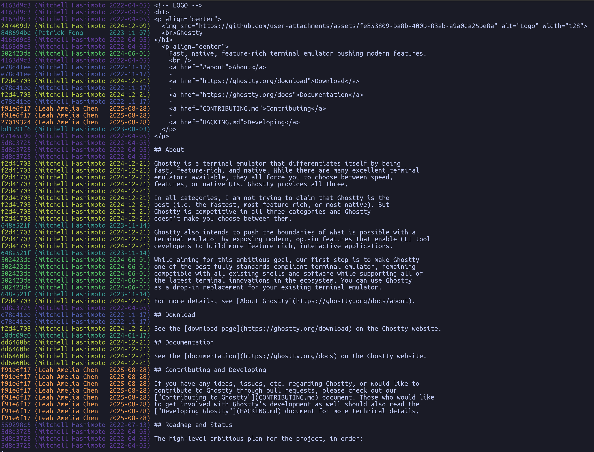

# git-colorblame

A git tool that displays `git blame` output with age-based heatmap coloring. Older commits appear in cold colors (purple/blue), newer commits in hot colors (yellow/orange).



## Features

- Plasma-inspired color gradient for modern terminals
- Line numbers included in output
- Pager support (uses your configured git pager or `less`)
- Pass-through support for git blame options like `-L`
- Light/dark terminal background detection

## Requirements

- Python 3.9+
- Git
- Terminal with 24-bit (true color) support

## Installation

```bash
git clone https://github.com/quai/git-colorblame.git
cd git-colorblame
./install.sh
```

This copies `git-colorblame` to `~/.local/bin`. Git automatically discovers it as `git colorblame`.

### Installation Options

```bash
./install.sh              # Install to ~/.local/bin (recommended)
./install.sh --alias      # Install as git alias (uses current directory)
./install.sh --uninstall  # Remove git-colorblame
./install.sh --help       # Show help
```

**Note:** If `~/.local/bin` is not in your PATH, add this to your shell profile:
```bash
export PATH="$HOME/.local/bin:$PATH"
```

## Usage

```bash
# Basic usage
git colorblame <file>

# Blame specific line range
git colorblame -L 10,50 <file>

# Disable pager (output directly)
git colorblame --no-pager <file>

# Disable colors (for piping)
git colorblame --no-color <file>

# Force light/dark background mode
git colorblame --light <file>
git colorblame --dark <file>

# Or set via environment variable
export COLORBLAME_BACKGROUND=light
```

## Color Scale

The heatmap represents commit age relative to the file's history:

| Age | Color |
|-----|-------|
| Uncommitted | **White** |
| Oldest | Purple |
| ↓ | Blue |
| ↓ | Teal |
| ↓ | Green |
| ↓ | Yellow |
| Newest | Orange |

Uncommitted changes (staged or unstaged) are highlighted in white (dark background) or dark gray (light background) to stand out from the age gradient.

## Configuration

Configure via git config:

```bash
# Set background mode permanently
git config --global colorblame.background light

# Disable pager by default
git config --global colorblame.pager false
```

| Config Key | Values | Description |
|------------|--------|-------------|
| `colorblame.background` | `light`, `dark` | Terminal background mode |
| `colorblame.pager` | `true`, `false` | Enable/disable pager |

**Background detection priority:**
1. `--light` / `--dark` flags
2. `COLORBLAME_BACKGROUND` environment variable
3. `colorblame.background` git config
4. `COLORFGBG` environment variable (set by some terminals)
5. Defaults to dark

## Pager

The pager is determined in this order:
1. `GIT_PAGER` environment variable
2. `git config core.pager`
3. `PAGER` environment variable
4. `less -R` (if available)

## Uninstall

```bash
./install.sh --uninstall
```

Or manually:
```bash
rm ~/.local/bin/git-colorblame
git config --global --unset alias.colorblame  # if installed with --alias
```

## License

MIT
